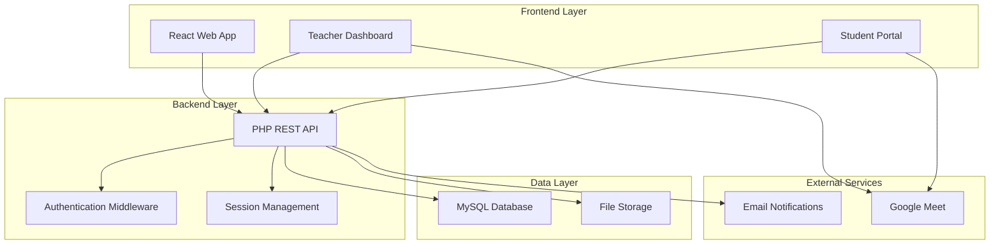

# Design Document: Live Teaching

## Overview

The Live Teaching system enables real-time educational sessions through a web-based platform that integrates with Google Meet for video conferencing. The system provides subject-based organization, session scheduling, and access control while maintaining simplicity and reliability.

The architecture follows a traditional web application pattern with a PHP backend, MySQL database, and React frontend. Google Meet integration is handled through direct URL linking rather than complex API integration, ensuring reliability and reducing technical complexity.

## Architecture

### System Components



### Technology Stack

- **Frontend**: React.js with modern JavaScript (ES6+)
- **Backend**: PHP 8+ with RESTful API architecture
- **Database**: MySQL 8.0+ with InnoDB storage engine
- **Authentication**: JWT-based session management
- **External Integration**: Google Meet via direct URL linking
- **Notifications**: Email-based notification system

## Components and Interfaces

### Database Schema

#### Core Tables

**live_subjects**
```sql
CREATE TABLE live_subjects (
    id INT PRIMARY KEY AUTO_INCREMENT,
    name VARCHAR(255) NOT NULL UNIQUE,
    description TEXT,
    created_at TIMESTAMP DEFAULT CURRENT_TIMESTAMP,
    updated_at TIMESTAMP DEFAULT CURRENT_TIMESTAMP ON UPDATE CURRENT_TIMESTAMP
);
```

**live_sessions**
```sql
CREATE TABLE live_sessions (
    id INT PRIMARY KEY AUTO_INCREMENT,
    subject_id INT NOT NULL,
    teacher_id INT NOT NULL,
    title VARCHAR(255) NOT NULL,
    description TEXT,
    google_meet_link VARCHAR(500) NOT NULL,
    session_date DATE NOT NULL,
    start_time TIME NOT NULL,
    duration_minutes INT NOT NULL DEFAULT 60,
    status ENUM('scheduled', 'live', 'completed', 'cancelled') DEFAULT 'scheduled',
    max_participants INT DEFAULT NULL,
    is_recurring BOOLEAN DEFAULT FALSE,
    recurrence_pattern ENUM('weekly', 'biweekly', 'monthly') DEFAULT NULL,
    recurrence_end_date DATE DEFAULT NULL,
    created_at TIMESTAMP DEFAULT CURRENT_TIMESTAMP,
    updated_at TIMESTAMP DEFAULT CURRENT_TIMESTAMP ON UPDATE CURRENT_TIMESTAMP,
    
    FOREIGN KEY (subject_id) REFERENCES live_subjects(id) ON DELETE CASCADE,
    FOREIGN KEY (teacher_id) REFERENCES users(id) ON DELETE CASCADE,
    
    CONSTRAINT unique_teacher_session UNIQUE (teacher_id, session_date, start_time),
    INDEX idx_subject_date (subject_id, session_date),
    INDEX idx_teacher_date (teacher_id, session_date),
    INDEX idx_status_date (status, session_date)
);
```

**session_participants**
```sql
CREATE TABLE session_participants (
    id INT PRIMARY KEY AUTO_INCREMENT,
    session_id INT NOT NULL,
    student_id INT NOT NULL,
    joined_at TIMESTAMP NULL,
    left_at TIMESTAMP NULL,
    duration_minutes INT DEFAULT 0,
    notification_sent BOOLEAN DEFAULT FALSE,
    created_at TIMESTAMP DEFAULT CURRENT_TIMESTAMP,
    
    FOREIGN KEY (session_id) REFERENCES live_sessions(id) ON DELETE CASCADE,
    FOREIGN KEY (student_id) REFERENCES users(id) ON DELETE CASCADE,
    
    CONSTRAINT unique_session_participant UNIQUE (session_id, student_id),
    INDEX idx_session_student (session_id, student_id),
    INDEX idx_student_sessions (student_id, created_at)
);
```

### API Endpoints

#### Teacher Endpoints

**POST /api/teacher/live-sessions**
- Create new live session
- Validates Google Meet link format
- Handles recurring session generation

**GET /api/teacher/live-sessions**
- Retrieve teacher's sessions with filtering
- Supports pagination and status filtering

**PUT /api/teacher/live-sessions/{id}**
- Update session details
- Validates scheduling conflicts

**DELETE /api/teacher/live-sessions/{id}**
- Cancel session and notify participants

#### Student Endpoints

**GET /api/student/live-sessions**
- Browse available sessions by subject
- Filter by date range, subject, status

**POST /api/student/live-sessions/{id}/join**
- Record student joining session
- Return Google Meet link if session is active

**GET /api/student/live-sessions/my-sessions**
- Retrieve student's registered sessions

#### Shared Endpoints

**GET /api/live-subjects**
- Retrieve all available subjects

**GET /api/live-sessions/{id}/details**
- Get session details with access control

## Data Models

### Session Model

```php
class LiveSession {
    private int $id;
    private int $subjectId;
    private int $teacherId;
    private string $title;
    private string $description;
    private string $googleMeetLink;
    private DateTime $sessionDate;
    private DateTime $startTime;
    private int $durationMinutes;
    private string $status;
    private ?int $maxParticipants;
    private bool $isRecurring;
    private ?string $recurrencePattern;
    private ?DateTime $recurrenceEndDate;
    
    public function isActive(): bool;
    public function canJoin(): bool;
    public function getJoinableTimeWindow(): array;
    public function generateRecurringSessions(): array;
}
```

### Subject Model

```php
class LiveSubject {
    private int $id;
    private string $name;
    private string $description;
    private DateTime $createdAt;
    
    public function getActiveSessions(): array;
    public function getSessionCount(): int;
}
```

### Participant Model

```php
class SessionParticipant {
    private int $id;
    private int $sessionId;
    private int $studentId;
    private ?DateTime $joinedAt;
    private ?DateTime $leftAt;
    private int $durationMinutes;
    private bool $notificationSent;
    
    public function recordJoin(): void;
    public function recordLeave(): void;
    public function calculateDuration(): int;
}
```

## Correctness Properties

*A property is a characteristic or behavior that should hold true across all valid executions of a system-essentially, a formal statement about what the system should do. Properties serve as the bridge between human-readable specifications and machine-verifiable correctness guarantees.*

Let me analyze the acceptance criteria to determine which ones are testable as properties:

<function_calls>
<invoke name="prework">
<parameter name="featureName">live-teaching

### Property Reflection

After reviewing all properties identified in the prework analysis, I've identified several areas where properties can be consolidated to eliminate redundancy:

**Session Creation Properties**: Properties 1.1-1.5 can be combined into comprehensive session creation validation properties.

**Access Control Properties**: Properties 2.5, 6.5, and 7.4 all relate to authorization and can be consolidated.

**Filtering and Search Properties**: Properties 3.3, 5.1, 5.2, and 5.3 can be combined into comprehensive filtering properties.

**Temporal Access Properties**: Properties 4.1, 4.2, 4.3, and 10.5 all relate to time-based access control and can be consolidated.

**Notification Properties**: Properties 9.1-9.5 can be streamlined to focus on core notification functionality.

### Core Correctness Properties

**Property 1: Session Creation Validation**
*For any* session creation request, if required fields (subject, title, description, date, time, Google Meet link) are missing or invalid, the system should reject the request and return appropriate error messages
**Validates: Requirements 1.1, 1.2, 1.3**

**Property 2: Future Date Validation**
*For any* session creation or update request, if the scheduled date and time is in the past, the system should reject the request
**Validates: Requirements 1.3**

**Property 3: Session Data Persistence**
*For any* successfully created session, all provided session data should be stored with a unique ID and creation timestamp
**Validates: Requirements 1.4, 1.5**

**Property 4: Teacher Session Ownership**
*For any* teacher and any session management operation (view, edit, delete), teachers should only be able to access sessions they created
**Validates: Requirements 2.1, 2.5, 6.5**

**Property 5: Session Update Validation**
*For any* session update request, all modifiable fields (title, description, date, time, Google Meet link) should be updatable while maintaining data integrity
**Validates: Requirements 2.2**

**Property 6: Scheduling Conflict Prevention**
*For any* teacher, session date, and time combination, the system should prevent creating or updating sessions that would create scheduling conflicts for the same teacher
**Validates: Requirements 2.4, 8.5**

**Property 7: Subject-Based Session Grouping**
*For any* student request to view sessions, sessions should be properly grouped by subject and contain all required display information
**Validates: Requirements 3.1, 3.2**

**Property 8: Session Filtering Accuracy**
*For any* filter criteria (subject, date range, status), the returned sessions should match exactly the specified criteria
**Validates: Requirements 3.3, 5.1, 5.3**

**Property 9: Session Search Functionality**
*For any* search query, the system should return sessions where the query text appears in either the title or description
**Validates: Requirements 5.2**

**Property 10: Student Session Visibility**
*For any* student request to view sessions, only active and upcoming sessions should be returned, excluding past or cancelled sessions
**Validates: Requirements 3.5**

**Property 11: Temporal Access Control**
*For any* session join request, Google Meet links should only be accessible when the session is currently live or starting within the allowed time window
**Validates: Requirements 4.1, 4.2, 4.3, 10.5**

**Property 12: Session Status Management**
*For any* session, the status should accurately reflect the current state and be updated appropriately when sessions end or are cancelled
**Validates: Requirements 4.4, 10.4**

**Property 13: Authentication Required**
*For any* request to access session links or live teaching features, the user must be properly authenticated
**Validates: Requirements 4.5, 7.1**

**Property 14: Attendance Tracking Accuracy**
*For any* student joining a session, the system should accurately record join timestamps and calculate session duration
**Validates: Requirements 6.1, 6.2**

**Property 15: Recurring Session Generation**
*For any* recurring session configuration, the system should generate the correct number of individual session instances with proper date calculations based on the recurrence pattern
**Validates: Requirements 8.3**

**Property 16: Google Meet Link Validation**
*For any* Google Meet link provided during session creation, the link should match the expected Google Meet URL format
**Validates: Requirements 10.1**

**Property 17: Notification Subscription Management**
*For any* student and session combination, students should be able to subscribe to and unsubscribe from session notifications
**Validates: Requirements 9.1, 9.4**

## Error Handling

### Input Validation Errors

- **Invalid Session Data**: Return structured error messages indicating which required fields are missing or invalid
- **Past Date Scheduling**: Reject attempts to schedule sessions in the past with clear temporal validation messages
- **Invalid Google Meet Links**: Validate URL format and provide guidance for correct link generation

### Authorization Errors

- **Unauthorized Access**: Return 401/403 status codes for authentication/authorization failures
- **Cross-Teacher Access**: Prevent teachers from accessing other teachers' sessions with appropriate error messages
- **Student Link Access**: Control access to Google Meet links based on session timing and authentication

### Scheduling Conflicts

- **Teacher Double-Booking**: Detect and prevent scheduling conflicts for the same teacher
- **Recurring Session Conflicts**: Validate each generated recurring session for potential conflicts

### External Service Integration

- **Google Meet Availability**: Handle cases where Google Meet links become inaccessible
- **Notification Delivery**: Implement retry mechanisms for failed notification deliveries

## Testing Strategy

### Dual Testing Approach

The Live Teaching system will employ both unit testing and property-based testing to ensure comprehensive coverage:

**Unit Tests** will focus on:
- Specific examples of session creation, updates, and deletions
- Edge cases like boundary date/time values
- Error conditions and exception handling
- Integration points between components

**Property-Based Tests** will verify:
- Universal properties that hold across all inputs
- Comprehensive input coverage through randomization
- Complex scenarios with generated test data

### Property-Based Testing Configuration

- **Testing Framework**: PHPUnit with Eris property-based testing library
- **Test Iterations**: Minimum 100 iterations per property test
- **Test Tagging**: Each property test tagged with format: **Feature: live-teaching, Property {number}: {property_text}**

### Testing Coverage Areas

**Core Functionality Testing**:
- Session CRUD operations with various input combinations
- Subject-based filtering and organization
- Temporal access control for Google Meet links
- Recurring session generation algorithms

**Security and Access Control Testing**:
- Authentication and authorization enforcement
- Cross-user access prevention
- Session link security and timing controls

**Data Integrity Testing**:
- Database constraint validation
- Concurrent access handling
- Transaction rollback scenarios

**Integration Testing**:
- Google Meet link validation and access
- Email notification delivery
- Frontend-backend API integration

The testing strategy ensures that both specific use cases and general system properties are thoroughly validated, providing confidence in the system's reliability and correctness.